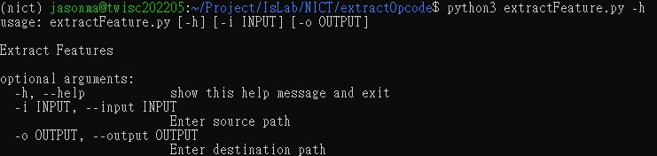

# Extract Opcode

- extractFeature.py
- extractOpcode_retdec.py
- extractOpcode_radare2.py

# How to Use?

## Set Up Retdec

Create a symbolic link for retdec-decompiler in bin.

`ln -s <path/to/retdec-decompiler> /usr/bin/retdec-decompiler`

## Operation

`python3 extractFeature.py -h`

### Extract Opcode sequence using Retdec

`python3 extractFeature.py -t retdec -i <path/to/source> -o <path/to/destination>`

### Extract Opcode sequence using Radare2

`python3 extractFeature.py -t radare2 -i <path/to/source> -o <path/to/destination>`

# NEW !!!

- run_reverse.sh
- new_extractOpcode_retdec.py

`run_reverse.sh <path/to/source> <path/to/destination> <path/to/sample_list.txt>`

1. The output `state_log.txt` has a record of the reverse situation of each sample.
2. Use `TIMEOUT` in `run_reverse.sh` to limit the reverse time.
3. Use `WORKERS` in `run_reverse.sh` to control the amount of PP used.