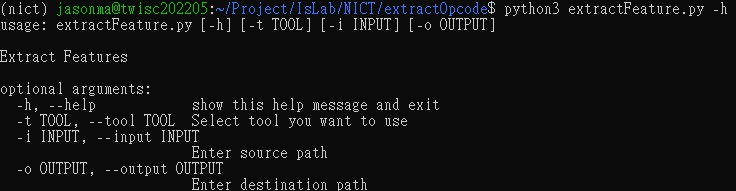

# Extract Opcode

- extractFeature.py
- extractOpcode.py

# How to Use?

## Set Up

Create a symbolic link for retdec-decompiler in bin.

`ln -s <path/to/retdec-decompiler> /usr/bin/retdec-decompiler`

## Operation

`python3 extractFeature.py -h`

`python3 extractFeature.py -i <path/to/source> -o <path/to/destination>`
