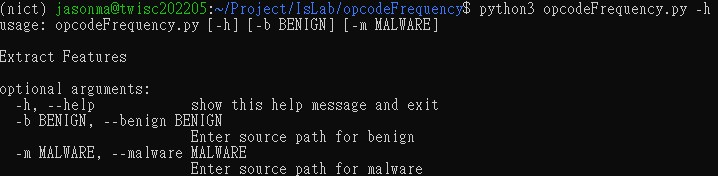
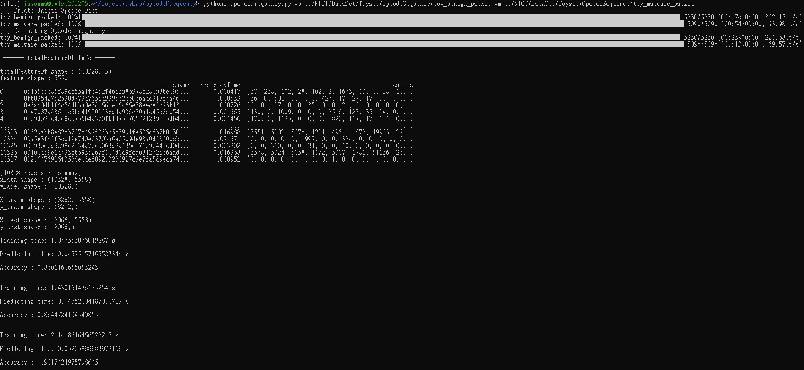

# OpcodeFrequency

# How to Use?

`python3 opcodeFrequency.py -h`

`python3 opcodeFrequency.py -b ../NICT/DataSet/Toyset/OpcodeSequence/toy_benign_packed -m ../NICT/DataSet/Toyset/OpcodeSequence/toy_malware_packed`

# Experiment

[Expriment using Retdec](expriment/expt_retdec.md)

