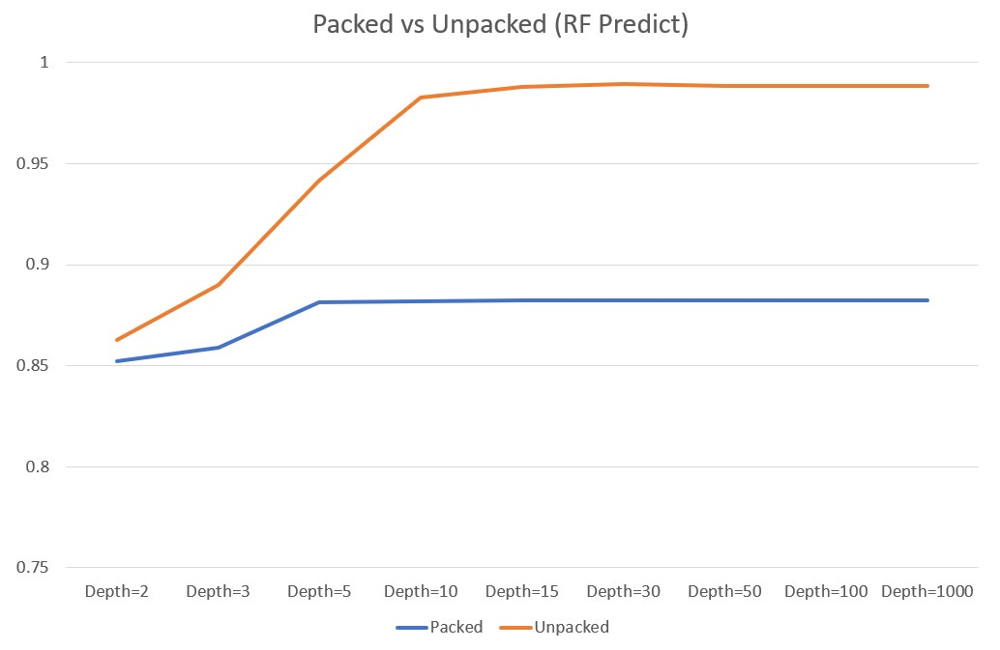

# Experiment (Radare2)

## Packed Dataset

- begin packed: 5210
- malware packed: 5097
- feature shape: 2055 (It means there are 2055 different opcodes int the dataset)
---
- xData shape: (10307, 2055)
- yLabel shape: (10307,)
---
- X_train shape: (8245, 2055)
- y_train shape: (8245)
---
- X_test shape: (2062, 2055)
- y_test shape: (2062,)

## Unpacked Dataset

- begin unpacked: 5230
- malware unpacked: 5098
- feature shape: 615 (It means there are 5538 different opcodes int the dataset)
---
- xData shape: (10328, 615)
- yLabel shape: (10328,)
---
- X_train shape: (8262, 615)
- y_train shape: (8262)
---
- X_test shape: (2066, 615)
- y_test shape: (2066,)

## Experimental Result

- Both of them have bottlenecks on around 88% (packed) and 98% (unpacked).
- Unpacked samples always have higer accuracy then packed samples in every different depth of RF.
- Both of them couldn't perform better since depth over 10.

- Unpacked samples always train faster then packed samples in every different depth of RF since unpacked samples have less feature dimensions then packed samples which makes sence.

- Unpacked samples also always predict faster then packed samples in every different depth of RF.

## Discussion

### Question 1: Does packed sample provide USEFUL informations for ML model to detect malware or benign?

- Yes, since the packed samples have already achieved 88% accuracy, apparently ML model notices the difference between malware and benign.
- The informations provide by packed samples may benifit ML model for training.

### Question 2: Does packed sample provide ENOUGH informations for ML model to detect malware or benign?

- No, since we achieved 98% accuracy using unpacked smaples.
- There have to be some informations that packed sample didn't provide but have great significance.

### Question 3: Does the informations provide by packed samples belong to the sample itself?

1. Compare the lengths of packed samples and unpacked samples.
    - [Benign] 698 of the unpacked samples are longer than packed samples.
    - [Benign] 138 of the packed samples are longer than unpacked samples.
    - [Benign] 4347 of the unpacked samples as long as packed samples, but none of them are the same.
    - [Malware] 3836 of the unpacked samples are longer than packed samples.
    - [Malware] 54 of the packed samples are longer than unpacked samples.
    - [Malware] 1207 of the unpacked samples as long as packed samples, but none of them are same.

# Problem
