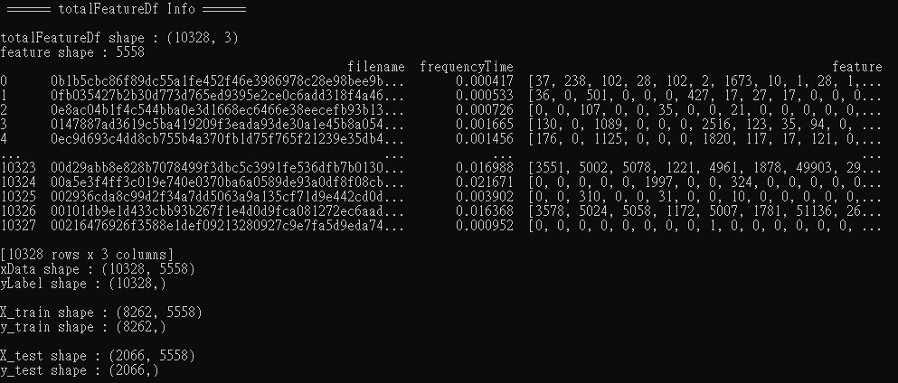
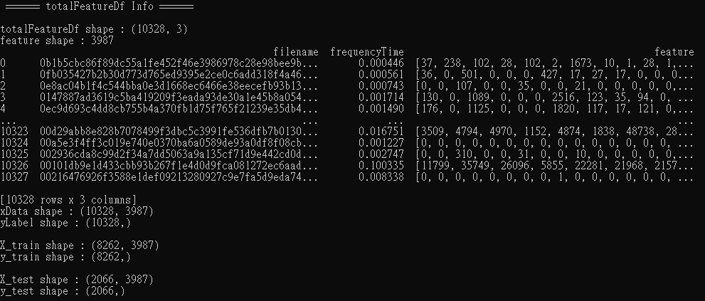
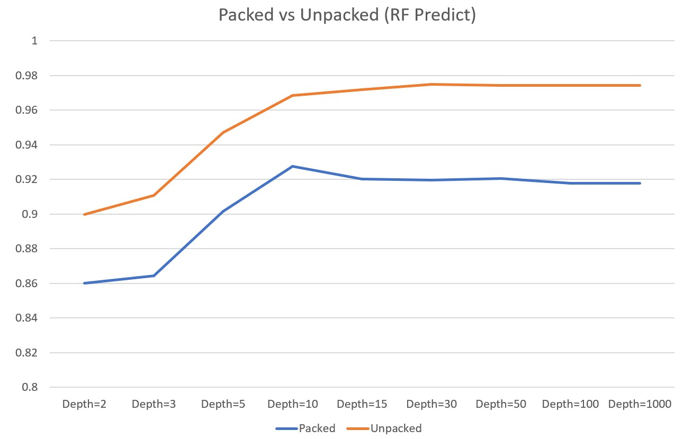
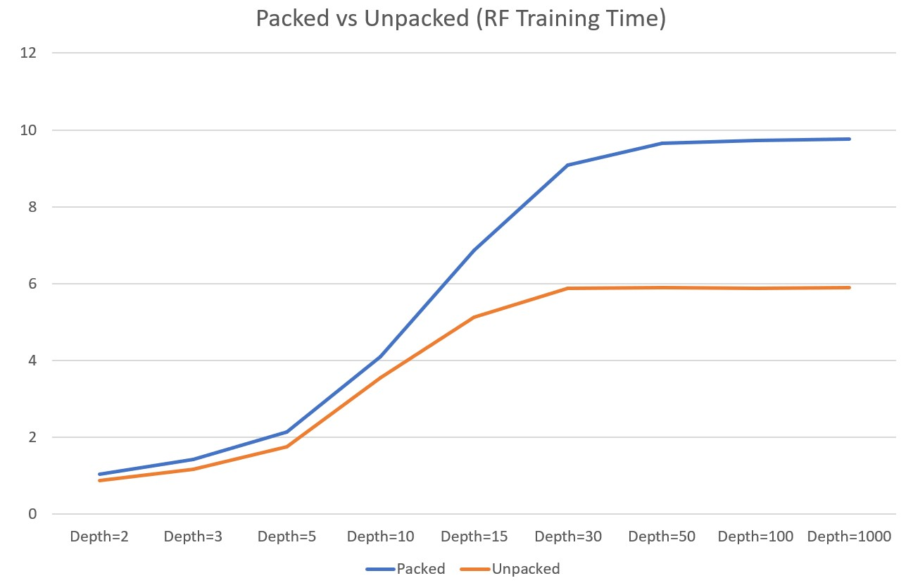
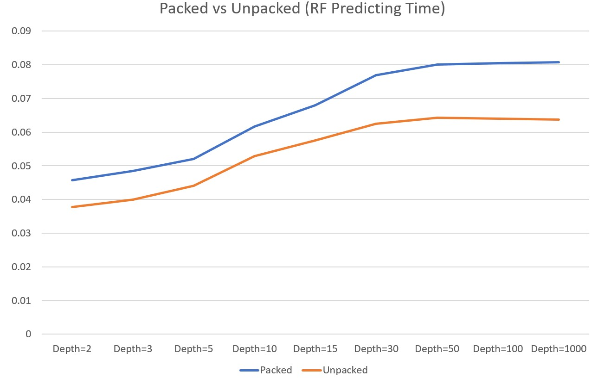
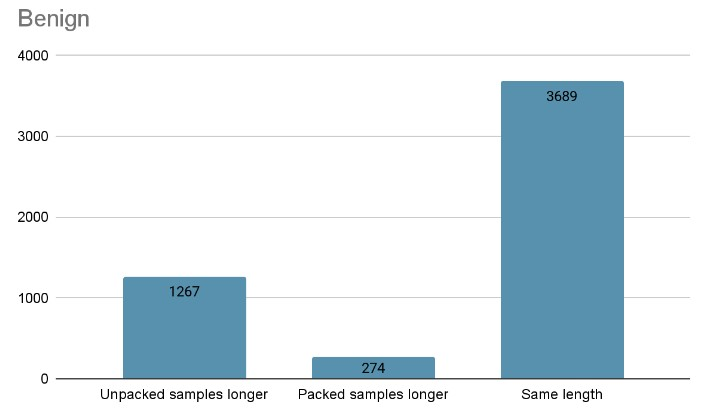
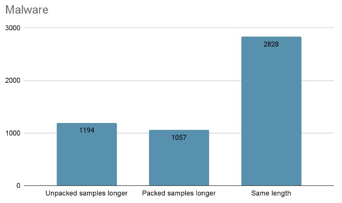
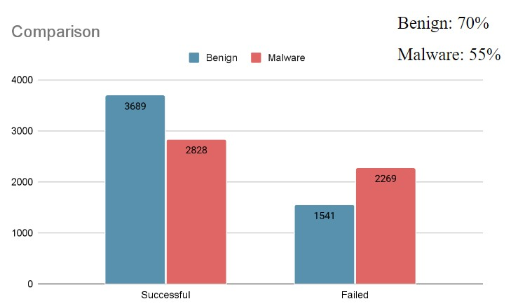

# Experiment (Retdec)

## Packed Dataset

- begin packed: 5230
- malware packed: 5098
- feature shape: 5558 (It means there are 5558 different opcodes int the dataset)
---
- xData shape: (10328, 5558)
- yLabel shape: (10328,)
---
- X_train shape: (8262, 5558)
- y_train shape: (8262)
---
- X_test shape: (2066, 5558)
- y_test shape: (2066,)

## Unpacked Dataset

- begin unpacked: 5230
- malware unpacked: 5098
- feature shape: 3978 (It means there are 3978 different opcodes int the dataset)
---
- xData shape: (10328, 3978)
- yLabel shape: (10328,)
---
- X_train shape: (8262, 3978)
- y_train shape: (8262)
---
- X_test shape: (2066, 3978)
- y_test shape: (2066,)

## Experimental Result

- Both of them have bottlenecks on around 91% (packed) and 97% (unpacked).
- Unpacked samples always have higer accuracy then packed samples in every different depth of RF.
- Both of them couldn't perform better since depth over 10.

- Unpacked samples always train faster then packed samples in every different depth of RF since unpacked samples have less feature dimensions then packed samples which makes sence.

- Unpacked samples also always predict faster then packed samples in every different depth of RF.

## Discussion

### Question 1: Does packed sample provide USEFUL informations for ML model to detect malware or benign?

- Yes, since the packed samples have already achieved 91% accuracy, apparently ML model notices the difference between malware and benign.
- The informations provide by packed samples may benifit ML model for training.

### Question 2: Does packed sample provide ENOUGH informations for ML model to detect malware or benign?

- No, since we achieved 97% accuracy using unpacked smaples.
- There have to be some informations that packed sample didn't provide but have great significance.

### Question 3: Does the informations provide by packed samples belong to the sample itself?

- Unconfirmed, there is huge difference between those two feature shape, packed sample dataset provide 5558 different opcodes while unpacked sample dataset only provide 3978 different opcodes.
- That's means there are 1580 opcodes that doesn't appear in unpacked samples which sounds weird.

# Feature Investigation

According to the avast development team, retdec tried to unpack during reverse engineering. [ref](https://github.com/avast/retdec/issues/1128)

They explained the three situations in my experiment:

- **len(unpacked sample OPS) > len(packed samples OPS)**
    - Indicates that the unpacking failed during the reverse process.
    - As a result, there are many compressed data in the packed sample that cannot be parsed into opcode.
- **len(packed sample OPS) > len(unpacked sample OPS)**
    - Indicates that the unpacking failed during the reverse process.
    - Although there are a lot of compressed data in the packed sample, the reverse engineer overdecodes them into opcodes, which are likely to be garbage opcodes.
- **len(packed sample OPS) == len(unpacked sample OPS)**
    - Indicates that the unpacking was successful during the reverse process.
    - Successful unpacking means the samples are the same, so the OPS will be the same.

## OPS comparison of malware vs benign

### Benign

- **Total 1267 sample** len(unpacked sample OPS) > len(packed sample OPS)
- **Total 274 sample** len(packed sample OPS) > len(unpacked sample OPS)
- **Total 3689 sample** len(unpacked sample OPS) == len(packed sample OPS)，totally EQUAL.

### Malware

- **Total 1194 sample** len(unpacked sample OPS) > len(packed sample OPS)
- **Total 1057 sample** len(packed sample OPS) > len(unpacked sample OPS)
- **Total 2828 sample** len(unpacked sample OPS) == len(packed sample OPS)，totally EQUAL.

### Total Comparison

- Generally speaking, benign samples has higher unpacking successful rate during reverse than malware samples.

# Problem

- 